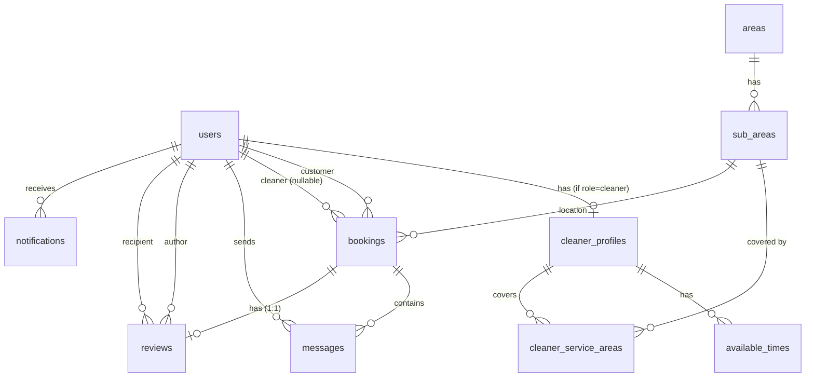

# 02. DB 스키마 & 데이터 모델

PostgreSQL(Neon/Supabase) + **Drizzle ORM** 기반의 데이터 모델 설계 문서입니다.

- 대상: C2C 청소 예약(요청자/제공자), 예약 기반 메시지, 리뷰, 알림
- 목표: **타입 안전성**, **정합성(FK/UNIQUE/ENUM/Index)**, **MVP에 과하지 않은 확장성**
- 기준 스키마 코드: `apps/web/server/db/schema/*.ts`
- 문서 버전: **v7 (2026-02-11)**

> 이 문서는 “테이블 정의 나열”보다, **왜 이런 구조인지 / 어떤 규칙으로 운용해야 안전한지**를 설명합니다.

---

## 0) 기본 규칙 (Conventions)

### 0.1 Primary Key / ID
- 모든 PK는 `text`(UUID 문자열)
- 기본값: `$defaultFn(() => crypto.randomUUID())`

장점
- 앱 레벨에서 ID 선점 가능(예: optimistic UI, 파일 업로드 키)
- Drizzle 타입 추론이 단순

---

### 0.2 Timestamp
- 대부분 테이블에 `created_at`, `updated_at`
- MVP에서는 `updated_at` 자동 갱신 트리거를 두지 않음
  - 서버 액션/서버 함수에서 갱신 책임

권장
- 모든 업데이트 mutation은 `updated_at = now()`를 일관되게 수행

---

### 0.3 Enum (DB enum으로 강제)
핵심 상태/타입은 PostgreSQL enum으로 강제하여 **상태값 오염**을 방지합니다.

현재 스키마에 정의된 enum
- `user_role`: `customer | cleaner`
- `booking_status`: `pending | confirmed | in_progress | completed | cancelled`
- `room_type`: `oneRoom | twoRoom | threeRoom | studio | office`
- `service_type`: `basic_cleaning | bathroom | kitchen | window | move_in | move_out`
- `message_type`: `text | image | system`
- `notification_type`:
  - `booking_created | booking_accepted | booking_rejected | booking_cancelled | booking_reminder | booking_completed | new_message | new_review`
- `review_tag`:
  - `친절해요 | 시간 준수 | 꼼꼼해요 | 깨끗해요 | 추천해요`

중요한 현실(Drizzle/Postgres 한계)
- `bookings.services`는 `text[]`
- `reviews.tags`는 `text[]`

즉, DB 차원에서 “배열 원소가 enum 멤버인지”까지는 강제하지 못합니다.
- 해결: **서버 액션에서 Zod/Validator로 원소 검증**

---

### 0.4 날짜/시간 모델 (KST 고정)
MVP에서는 예약 시각을 다음 3개 컬럼으로 표현합니다.
- `scheduled_date` (`date`)
- `scheduled_time` (`time`)
- `duration` (`int`, 시간 단위)

의도
- 모바일 UI(날짜/시간 픽커)와 직관적으로 1:1 매핑
- “KST 로컬 스케줄”이라는 의미를 강하게 고정

주의
- `created_at` 같은 이벤트 기록용 `timestamp`와 성격이 다릅니다.
- API/클라이언트에서 **KST 기준으로만 해석**하는 규칙을 고정하세요.

Post-MVP 확장
- 다국적/타임존 요구가 생기면 `scheduled_at (timestamptz)` + `timezone`(또는 지역)로 마이그레이션 권장

---

### 0.5 Soft delete
- MVP에서는 기본적으로 soft delete를 채택하지 않음
  - 사유: 조회 스코프/인덱스/권한 체크 복잡도 증가

필요해지면
- `deleted_at` 추가 + 모든 list/query에 “기본 where deleted_at is null” 스코프 규칙을 표준화

---

### 0.6 배열 컬럼 vs 조인 테이블
MVP에서 아래처럼 “선택 목록”이고 조회가 단순한 항목은 `text[]`로 둡니다.
- `bookings.services: text[]`
- `reviews.tags: text[]`

다만 다음 조건 중 하나를 만족하면 조인 테이블로 승격하세요.
- 항목에 속성(수량/가격/정렬/메모)이 붙는다
- 항목별 필터/집계가 중요해진다(예: 특정 서비스 포함 예약만 탐색)
- DB 차원의 정합성(FK/enum membership)이 반드시 필요하다

---

### 0.7 네이밍 규칙
- DB: `snake_case`
- Drizzle 스키마 필드: `camelCase`
- API/JSON: 원칙적으로 `camelCase`

권장
- DB row를 그대로 반환하지 말고, 서버 레이어에서 DTO로 정규화

---

### 0.8 FK `onDelete` 정책
- **종속(소유) 데이터** → `cascade`
  - 예: `cleaner_profiles.user_id`, `messages.booking_id`
- **기록 보존이 중요한 참조** → `set null` 또는 `restrict`
  - 예: `bookings.cleaner_id` (제공자 계정이 삭제되어도 예약 기록은 남김)

---

### 0.9 `relations.ts`의 역할(Drizzle)
- FK 제약은 각 테이블의 `references(() => ...)`에서 결정
- `relations.ts`는 join을 타입 안전하게 만들기 위한 **관계 그래프 선언**

권장
- “예약 상세” 같은 화면은 관계를 이용한 **단일 쿼리(또는 소수 쿼리)** 로 구성
- 민감정보가 섞이지 않게 select projection을 항상 명시

---

## 1) ERD (현재 스키마 기준)



> 주의: ERD는 관계를 설명하기 위한 도식입니다. 실제 컬럼/제약은 스키마 코드를 기준으로 보세요.

---

## 2) 테이블 설계 상세

### 2.1 `users`
- 파일: `apps/web/server/db/schema/users.ts`
- 목적: 인증/권한의 단일 주체

핵심 컬럼
- `email` (unique, not null)
- `password` (nullable): OAuth 유저는 null
- `name` (not null)
- `phone` (not null)
- `role` (`user_role`)
- `kakao_id`, `naver_id` (unique, nullable)
- `is_active`, `email_verified`

결정
- 고객/제공자를 “분리 테이블”로 두지 않고 `role`로 구분
  - 예약/메시지/리뷰 FK가 단순해짐

권장 검증
- `phone` 형식(E.164 또는 국내 형식) 통일
- OAuth 유저의 경우 `password is null` 규칙을 서버에서 강제

---

### 2.2 `cleaner_profiles`
- 파일: `apps/web/server/db/schema/cleaner-profiles.ts`
- 목적: 제공자(청소부) 전용 확장 정보

관계
- `user_id` → `users.id` (FK, `onDelete: cascade`)
- `user_id` unique (users:cleaner_profiles = 1:1)

핵심 컬럼
- `intro`, `price_per_hour`
- denormalized stats: `total_bookings`, `total_reviews`, `average_rating`
- 상태: `is_verified`, `is_available`

운영 규칙(권장)
- 리뷰 생성/수정 시 `total_reviews`, `average_rating`를 트랜잭션으로 갱신
- 예약 완료 처리 시 `total_bookings` 갱신

---

### 2.3 `areas`, `sub_areas`
- 파일: `apps/web/server/db/schema/areas.ts`
- 목적: 서비스 지역 계층(예: 구/동)

관계
- `sub_areas.area_id` → `areas.id` (FK, `onDelete: cascade`)

핵심 컬럼
- `name`, `sort_order`

seed 권장
- 지역 데이터는 마이그레이션에 하드코딩하기보다 `seed` 스크립트로 관리

---

### 2.4 `cleaner_service_areas`
- 파일: `apps/web/server/db/schema/cleaner-service-areas.ts`
- 목적: 제공자-지역 매핑(N:M)

제약
- `unique(profile_id, sub_area_id)`로 중복 등록 방지

---

### 2.5 `available_times`
- 파일: `apps/web/server/db/schema/available-times.ts`
- 목적: 제공자의 요일별 정기 가능 시간

핵심 컬럼
- `day_of_week` (0~6): 0=일요일
- `start_time`, `end_time`

정합성(현재: 앱 레벨)
- `start_time < end_time`
- 동일 `profile_id + day_of_week` 내 시간대 겹침 방지

확장
- 특정 날짜 예외(휴무/추가 오픈)를 지원하려면 `availability_exceptions` 테이블 추가

---

### 2.6 `bookings`
- 파일: `apps/web/server/db/schema/bookings.ts`
- 목적: “요청 등록 → 수락 → 진행 → 완료/취소”의 단일 엔티티

관계
- `customer_id` → `users.id` (FK, cascade)
- `cleaner_id` → `users.id` (FK, set null)
- `sub_area_id` → `sub_areas.id`

상태
- `status` (`booking_status`)
  - `pending` → `confirmed` → `in_progress` → `completed`
  - 언제든 취소되면 `cancelled`

일정
- `scheduled_date`, `scheduled_time`, `duration`

주소/요청
- `address`, `address_detail`
- `room_type`, `room_size`
- `services: text[]` (서버에서 `service_type` 멤버만 허용)
- `description`, `budget`

완료/취소
- 완료: `completion_photos[]`, `completion_notes`, `completed_at`
- 취소: `cancelled_by`, `cancel_reason`, `cancelled_at`

인덱스(현재 스키마에 포함)
- `(customer_id, status)`
- `(cleaner_id, status)`
- `(sub_area_id, scheduled_date)`
- `(status, scheduled_date)`

운영 규칙(권장)
- 상태 전이는 서버에서만 수행
- `confirmed` 전환 시 `cleaner_id`를 반드시 세팅
- `completed` 전환 시 `completed_at` 필수
- `cancelled` 전환 시 `cancelled_at`, `cancelled_by` 필수

동시 수락 경쟁(핵심)
- `accept`는 반드시 “조건부 업데이트”로 처리
  - 예: `WHERE status='pending' AND cleaner_id IS NULL`
  - 실패 시 `CONFLICT` 반환

---

### 2.7 `messages`
- 파일: `apps/web/server/db/schema/messages.ts`
- 목적: 예약 기반 메시지(MVP 폴링)

관계
- `booking_id` → `bookings.id` (cascade)
- `sender_id` → `users.id` (cascade)

핵심 컬럼
- `type`, `content`, `image_url`
- `is_read`, `read_at` (MVP 단순 모델)

인덱스
- `(booking_id, created_at)`

확장
- 멀티 디바이스 읽음/안읽음 정교화가 필요하면 `message_reads`(N:M)로 분리

---

### 2.8 `reviews`
- 파일: `apps/web/server/db/schema/reviews.ts`
- 목적: 청소 완료 후 리뷰(별점/내용/태그)

현재 제약
- `booking_id` unique → 예약당 리뷰 1개

의미
- MVP에서는 우선 “고객 → 청소부” 1개 리뷰로 출발하기 쉬움
- 다만 스키마는 `author_id`, `recipient_id`를 이미 가지고 있어 “상호 리뷰” 확장도 가능

상호 리뷰로 확장하는 방법(권장 2안)
1) `unique(booking_id, author_id)`로 변경하여 예약당 2개 허용
2) `review_threads`(예약당 1개) + `review_entries`(2개)로 분리

검증(서버)
- `rating`은 1~5만 허용
- `tags[]`는 `review_tag` 멤버만 허용

인덱스
- `(author_id)`
- `(recipient_id, created_at)`

---

### 2.9 `notifications`
- 파일: `apps/web/server/db/schema/notifications.ts`
- 목적: 인앱 알림/푸시 원천 데이터

관계
- `user_id` → `users.id` (cascade)

핵심 컬럼
- `type`, `title`, `body`
- `related_type`, `related_id` (딥링크)
- `is_read`, `read_at`

인덱스
- `(user_id, is_read)`
- `(user_id, created_at)`

---

## 3) 조회 패턴 & 인덱싱 가이드

자주 하는 쿼리
- 고객: 내 예약 목록(status별)
  - 인덱스: `(customer_id, status)`
- 제공자: 내가 수락한/진행중 예약
  - 인덱스: `(cleaner_id, status)`
- 메시지 로딩
  - 인덱스: `(booking_id, created_at)`
- 알림 리스트
  - 인덱스: `(user_id, created_at)`

향후(옵션)
- 캘린더 뷰/중복 방지 강화 시
  - `(cleaner_id, scheduled_date, scheduled_time)`

---

## 4) 서버 액션에서 강제해야 하는 정합성 체크리스트

DB 제약만으로 부족한 규칙을 서버에서 **반드시 검증/거절**합니다.

- `users.role = cleaner`인 경우에만 `cleaner_profiles` 생성 허용
- `bookings.status = confirmed`이면 `cleaner_id not null` 강제
- `bookings.status = completed`이면 `completed_at` 세팅
- `bookings.status = cancelled`이면 `cancelled_at`, `cancelled_by` 세팅
- `available_times`의 시간대 겹침 방지
- `bookings.services[]`는 `service_type`만 허용
- `reviews.tags[]`는 `review_tag`만 허용

---

## 5) 예약 상태 전이(State machine) 가이드

권장 전이
- `pending` → `confirmed` (제공자 수락)
- `pending` → `cancelled` (요청자 취소)
- `confirmed` → `in_progress`
- `confirmed` → `cancelled`
- `in_progress` → `completed`
- `in_progress` → `cancelled`

권장 불변
- `completed`는 다른 상태로 변경 금지
- `cancelled`는 다른 상태로 변경 금지

---

## 6) Post-MVP로 승격할 수 있는 DB 레벨 제약

운영 전/후로 데이터 품질을 강화하고 싶다면 다음을 DB 레벨로 승격하세요.

- Check constraints
  - `available_times.start_time < available_times.end_time`
  - `reviews.rating BETWEEN 1 AND 5`
  - `bookings.duration > 0`

고급(충돌 방지)
- 예약 확정 이후 시간대 충돌을 DB에서 막고 싶으면 `tsrange` + `EXCLUDE USING gist` 고려

---

## 7) 마이그레이션/운영

- 스키마 위치: `apps/web/server/db/schema/`
- Drizzle kit

```bash
# 변경 감지 → 마이그레이션 생성
pnpm drizzle-kit generate

# 마이그레이션 실행
pnpm drizzle-kit migrate

# 개발용 push
pnpm drizzle-kit push
```

운영 권장
- 운영 DB에는 로컬 `push` 지양(CI에서 migrate 적용)
- `areas/sub_areas`는 별도 `seed` 스크립트로 관리

---

## 8) Post-MVP 확장 후보

- 결제/정산: `payments`, `payouts`, `refunds`
- 정기 예약: `recurring_bookings`, `booking_instances`
- 첨부파일 정규화: `booking_assets`, `message_assets`
- 감사/추적 로그: `audit_logs` (상태 전이/정산/권한 변경 이력)
