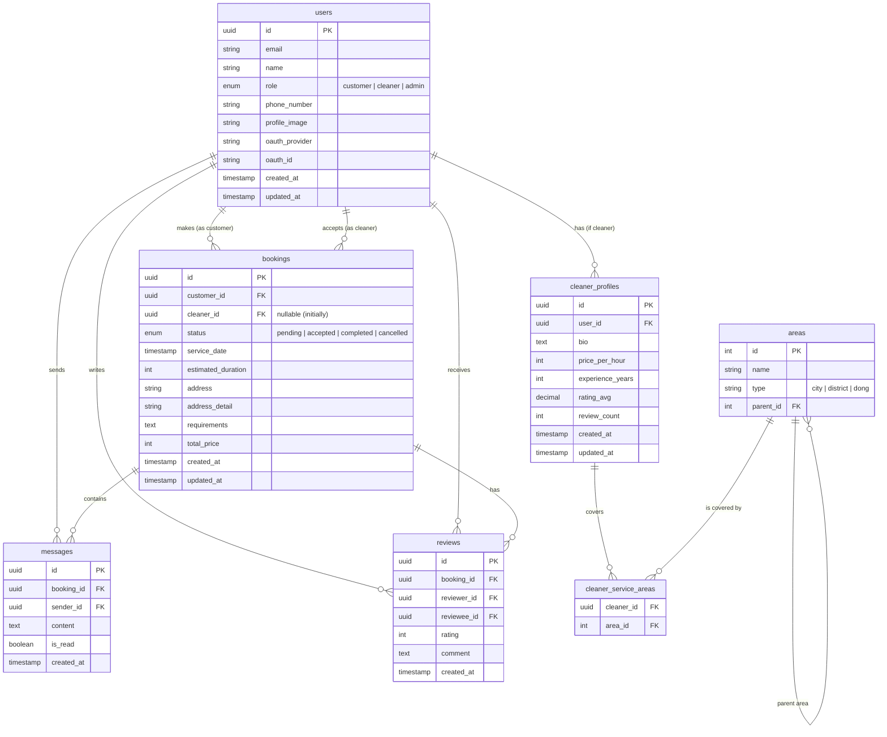

# 02. DB 스키마 & 데이터 모델

Drizzle ORM과 PostgreSQL을 기반으로 한 데이터베이스 설계 문서입니다.

## 🗄️ ERD (Entity Relationship Diagram)



---

## 📝 테이블 상세 명세

### 1. Users (사용자)
모든 사용자의 기본 정보를 저장합니다.

| 컬럼명 | 타입 | 설명 | 제약조건 |
|---|---|---|---|
| id | uuid | Primary Key | Default: `gen_random_uuid()` |
| email | varchar(255) | 이메일 | Unique, Not Null |
| name | varchar(100) | 실명 | Not Null |
| role | enum | 역할 | 'customer', 'cleaner', 'admin' (Default: 'customer') |
| phone_number | varchar(20) | 전화번호 | |
| profile_image | varchar(512) | 프로필 이미지 URL | |
| oauth_provider | varchar(50) | OAuth 제공자 | 'kakao', 'naver' 등 |
| oauth_id | varchar(255) | OAuth 고유 ID | |
| created_at | timestamp | 생성일 | Default: `now()` |
| updated_at | timestamp | 수정일 | Default: `now()` |

### 2. Cleaner Profiles (청소부 프로필)
청소부(role='cleaner')인 사용자의 추가 정보를 저장합니다.

| 컬럼명 | 타입 | 설명 | 제약조건 |
|---|---|---|---|
| id | uuid | Primary Key | |
| user_id | uuid | User FK | Unique, Not Null, References users(id) |
| bio | text | 자기소개 | |
| price_per_hour | integer | 시간당 요금 (원) | Not Null, Default: 0 |
| experience_years | integer | 경력 (년) | Default: 0 |
| rating_avg | decimal(3,2) | 평균 평점 | Default: 0.00 |
| review_count | integer | 리뷰 수 | Default: 0 |
| created_at | timestamp | 생성일 | |
| updated_at | timestamp | 수정일 | |

### 3. Areas (지역 코드)
서비스 가능한 지역(창원시 구/동 등)을 관리하는 기준 테이블입니다.

| 컬럼명 | 타입 | 설명 | 제약조건 |
|---|---|---|---|
| id | serial | Primary Key | |
| name | varchar(100) | 지역명 (예: 의창구, 사파동) | Not Null |
| type | varchar(20) | 지역 유형 | 'city', 'district', 'dong' |
| parent_id | integer | 상위 지역 ID | References areas(id) |

### 4. Cleaner Service Areas (청소부 활동 지역)
청소부가 활동 가능한 지역을 매핑합니다.

| 컬럼명 | 타입 | 설명 | 제약조건 |
|---|---|---|---|
| cleaner_id | uuid | Cleaner Profile FK | References cleaner_profiles(id) |
| area_id | integer | Area FK | References areas(id) |
| **PK** | | 복합키 | (cleaner_id, area_id) |

### 5. Bookings (예약)
청소 예약 정보를 관리합니다. 'Open Market' 방식을 가정하여, 초기 생성 시 `cleaner_id`는 NULL일 수 있습니다.

| 컬럼명 | 타입 | 설명 | 제약조건 |
|---|---|---|---|
| id | uuid | Primary Key | |
| customer_id | uuid | 요청자 FK | References users(id) |
| cleaner_id | uuid | 배정된 청소부 FK | References users(id), Nullable |
| status | enum | 예약 상태 | 'pending', 'accepted', 'completed', 'cancelled' |
| service_date | timestamp | 청소 희망 일시 | Not Null |
| estimated_duration | integer | 예상 소요 시간 (분) | Default: 120 (2시간) |
| address | varchar(255) | 주소 | Not Null |
| address_detail | varchar(255) | 상세 주소 | |
| requirements | text | 요청 사항 | |
| total_price | integer | 확정 금액 | Nullable (매칭 후 확정) |
| created_at | timestamp | 생성일 | |
| updated_at | timestamp | 수정일 | |

### 6. Messages (메시지)
예약 건에 대한 문의 및 조율을 위한 메시지입니다.

| 컬럼명 | 타입 | 설명 | 제약조건 |
|---|---|---|---|
| id | uuid | Primary Key | |
| booking_id | uuid | 예약 FK | References bookings(id) |
| sender_id | uuid | 발신자 FK | References users(id) |
| content | text | 내용 | Not Null |
| is_read | boolean | 읽음 여부 | Default: false |
| created_at | timestamp | 발신 시각 | |

### 7. Reviews (리뷰)
청소 완료 후 상호 작성하는 리뷰입니다.

| 컬럼명 | 타입 | 설명 | 제약조건 |
|---|---|---|---|
| id | uuid | Primary Key | |
| booking_id | uuid | 예약 FK | References bookings(id) |
| reviewer_id | uuid | 작성자 FK | References users(id) |
| reviewee_id | uuid | 대상자 FK | References users(id) |
| rating | integer | 평점 (1-5) | Check (rating >= 1 AND rating <= 5) |
| comment | text | 리뷰 내용 | |
| created_at | timestamp | 작성일 | |

---

## 🛠️ Drizzle ORM 구현 가이드

### Enum 정의
```typescript
// db/schema/enums.ts
export const userRoleEnum = pgEnum('user_role', ['customer', 'cleaner', 'admin']);
export const bookingStatusEnum = pgEnum('booking_status', ['pending', 'accepted', 'completed', 'cancelled']);
export const areaTypeEnum = pgEnum('area_type', ['city', 'district', 'dong']);
```

### Relations
`relations` 정의 시 순환 참조에 주의하며, `users` 테이블은 `customer_bookings`와 `cleaner_bookings`로 관계를 분리하여 정의하는 것을 권장합니다.

```typescript
// db/schema/relations.ts
export const usersRelations = relations(users, ({ many, one }) => ({
  cleanerProfile: one(cleanerProfiles),
  customerBookings: many(bookings, { relationName: 'customerBookings' }),
  cleanerBookings: many(bookings, { relationName: 'cleanerBookings' }),
  reviewsWritten: many(reviews, { relationName: 'reviewsWritten' }),
  reviewsReceived: many(reviews, { relationName: 'reviewsReceived' }),
}));
```
