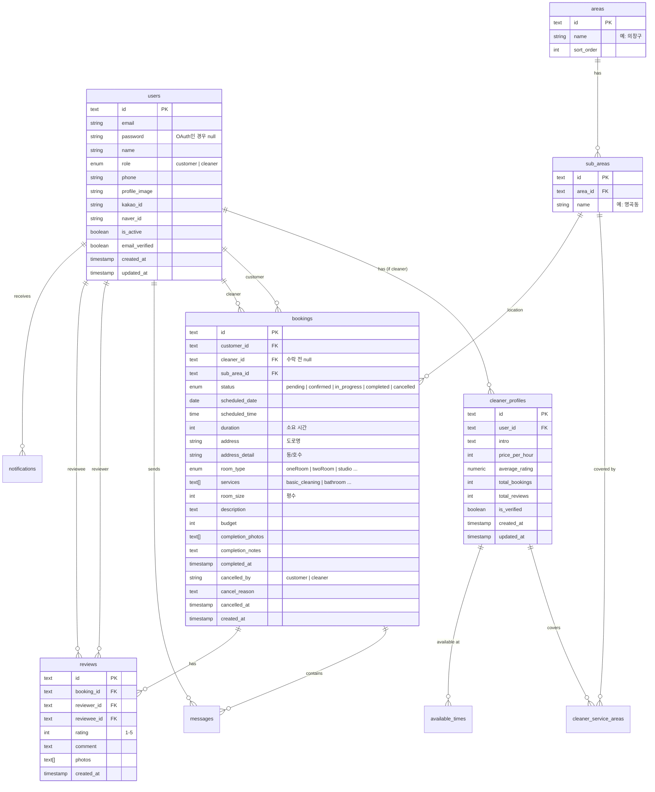

# 02. DB 스키마 & 데이터 모델

Drizzle ORM과 PostgreSQL(Neon)을 기반으로 한 데이터베이스 설계 문서입니다.
실제 코드는 `apps/web/server/db/schema/` 디렉토리에 구현되어 있습니다.

## 🗄️ ERD (Entity Relationship Diagram)

## 📝 테이블 상세 명세

### 1. Users (사용자)
`apps/web/server/db/schema/users.ts`
- **id**: UUID (text)
- **role**: `user_role` ('customer' | 'cleaner')
- **auth**: Kakao, Naver OAuth 연동 필드 포함
- **status**: `isActive`로 계정 활성화 상태 관리

### 2. Cleaner Profiles (청소부 프로필)
`apps/web/server/db/schema/cleaner-profiles.ts`
- `users` 테이블과 1:1 관계 (역할이 cleaner인 경우 생성)
- **pricePerHour**: 시간당 요금 (원 단위)
- **stats**: `totalBookings`, `averageRating` 등을 통해 빠른 조회 지원
- **isVerified**: 본인 인증 또는 신원 확인 여부

### 3. Areas & Sub Areas (지역)
`apps/web/server/db/schema/areas.ts`
- **areas**: 상위 행정구역 (예: 창원시 의창구, 성산구)
- **sub_areas**: 하위 행정구역 (예: 팔용동, 상남동)
- 지역 기반 필터링 및 서비스 가능 지역 설정의 기준

### 4. Cleaner Service Areas & Available Times
- **cleaner_service_areas**: 청소부가 서비스 가능한 하위 지역(`sub_area`) 매핑
- **available_times**: 요일별 활동 가능 시간대 정의 (예약 중복 방지 로직의 기초)

### 5. Bookings (예약)
`apps/web/server/db/schema/bookings.ts`
- **status**: 
    - `pending`: 요청 등록 (제공자 수락 대기)
    - `confirmed`: 제공자 수락 (예약 확정)
    - `in_progress`: 청소 진행 중
    - `completed`: 청소 완료
    - `cancelled`: 취소 (취소 주체 및 사유 기록)
- **room_type**: 원룸, 투룸, 오피스텔 등 구분
- **services**: 기본 청소, 화장실, 주방, 입주 청소 등 다중 선택 가능

### 6. Reviews & Messages
- **reviews**: `rating` (1~5점) 및 텍스트 리뷰. 사진 첨부 가능.
- **messages**: 특정 예약(`booking_id`)에 귀속된 메시지 기록.

## 🛠️ Drizzle ORM 구현 포인트

### UUID 및 기본 생성
애플리케이션 레벨에서 `crypto.randomUUID()`를 기본값으로 사용하여 클라이언트 사이드에서의 ID 선점 및 관리를 용이하게 합니다.

### PG Enum 활용
데이터 정합성을 위해 DB 레벨의 Enum을 적극적으로 사용합니다.
- `user_role`, `booking_status`, `room_type`, `service_type` 등

### 성능 최적화 (Index)
`bookings` 테이블과 같이 조회가 빈번한 테이블에는 복합 인덱스를 적용합니다.
- (customerId, status)
- (cleanerId, status)
- (subAreaId, scheduledDate)

### Relations 정의
`apps/web/server/db/schema/relations.ts`에 Drizzle의 전용 Relations API를 사용하여 복잡한 Join 쿼리를 타입 안전하게 처리합니다.
