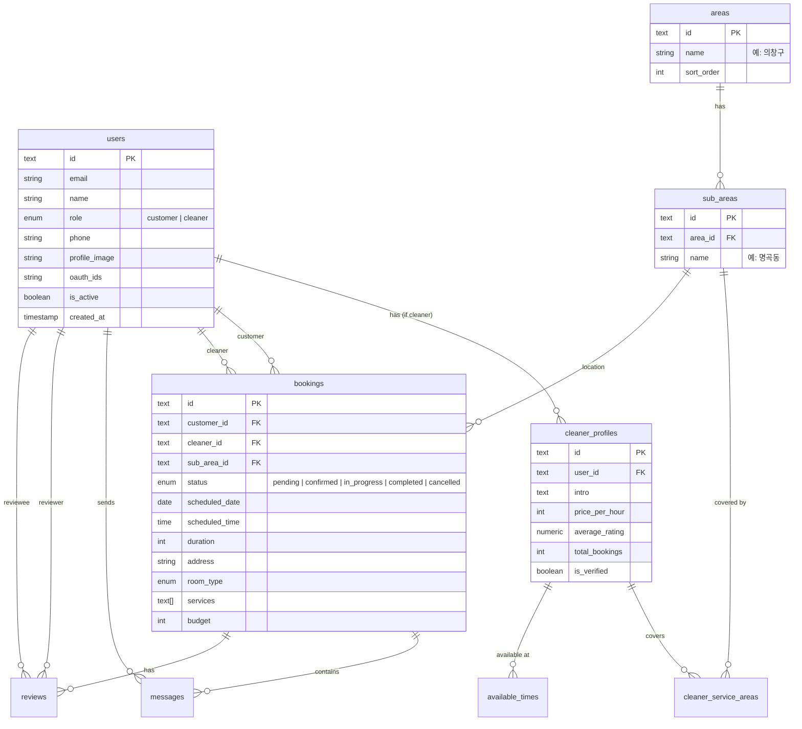

# 02. DB 스키마 & 데이터 모델

Drizzle ORM과 PostgreSQL(Neon)을 기반으로 한 데이터베이스 설계 문서입니다.
실제 코드는 `apps/web/server/db/schema/` 디렉토리에 구현되어 있습니다.

## 🗄️ ERD (Entity Relationship Diagram)

## 📝 테이블 상세 명세

### 1. Users (사용자)
`apps/web/server/db/schema/users.ts`
- **id**: UUID (text)
- **role**: 'customer' | 'cleaner'
- **oauth**: kakaoId, naverId 지원
- **status**: isActive, emailVerified

### 2. Cleaner Profiles (청소부 프로필)
`apps/web/server/db/schema/cleaner-profiles.ts`
- `users` 테이블과 1:1 관계 (role='cleaner'인 경우)
- **pricePerHour**: 시간당 요금 (원)
- **stats**: totalBookings, totalReviews, averageRating
- **verification**: isVerified (신원 확인 여부)

### 3. Areas & Sub Areas (지역)
`apps/web/server/db/schema/areas.ts`
- **areas**: 상위 행정구역 (예: 창원시 의창구, 성산구)
- **sub_areas**: 하위 행정구역 (예: 용지동, 사파동)
- 예약 및 청소부 활동 지역의 기준이 됨

### 4. Cleaner Service Areas & Available Times
- **cleaner_service_areas**: 청소부가 활동 가능한 `sub_area` 매핑 (M:N)
- **available_times**: 요일별(dayOfWeek 0~6) 활동 가능 시간(startTime, endTime)

### 5. Bookings (예약)
`apps/web/server/db/schema/bookings.ts`
- **status**: pending -> confirmed -> in_progress -> completed (or cancelled)
- **location**: `address` (도로명) + `sub_area_id` (지역 필터링용)
- **details**: `roomType` (oneRoom, twoRoom...), `services` (array of strings)
- **flow**:
    1. Customer가 `pending` 상태로 생성 (cleanerId = null)
    2. Cleaner가 수락하면 `confirmed` (cleanerId 업데이트)
    3. 서비스 완료 후 `completed`

### 6. Reviews & Messages
- **reviews**: 예약 완료 후 작성. 평점(1-5) 및 코멘트.
- **messages**: 예약(booking_id)에 종속된 채팅 메시지.

## 🛠️ Drizzle ORM 구현 포인트

### UUID 사용
PostgreSQL의 `uuid` 타입 대신 Drizzle의 `text`와 `crypto.randomUUID()`를 사용하여 애플리케이션 레벨에서 ID를 생성합니다. 이는 클라이언트 사이드 핸들링을 용이하게 합니다.

### Enum 관리
`pgEnum`을 사용하여 DB 레벨에서 정합성을 보장합니다.
- `user_role`
- `booking_status`
- `room_type`
- `service_type`

### Relations
Drizzle Relations API를 사용하여 애플리케이션 레벨의 Join을 최적화합니다.
- `users`는 `cleanerProfile`을 가질 수 있음
- `bookings`는 `customer`와 `cleaner` 두 명의 user와 연결됨
