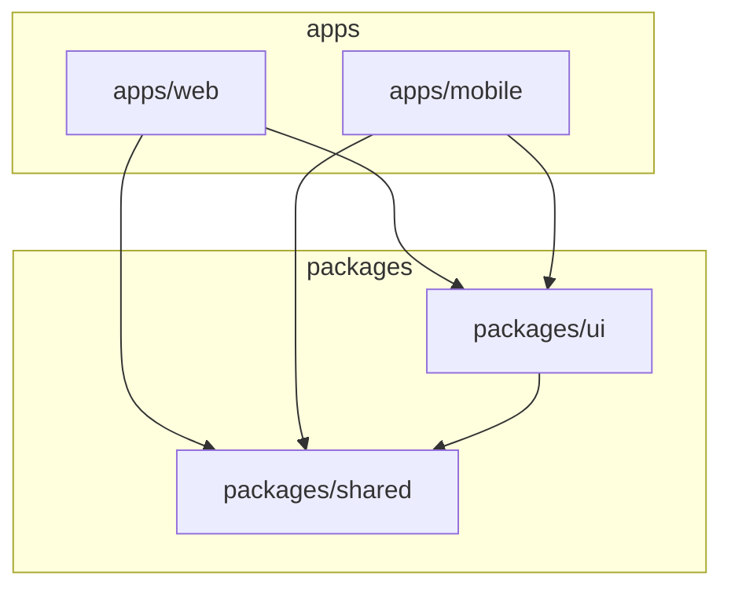

# Plan 07 - Monorepo Setup

## 1. Overview
We will adopt a **Monorepo** architecture using **pnpm workspaces** and **Turborepo** to manage the codebase efficiently. This structure allows code sharing between the web and mobile applications while maintaining isolation where necessary.

- **Package Manager**: pnpm
- **Build System**: Turborepo
- **Apps**: `web` (TanStack Start), `mobile` (Expo)
- **Packages**: `shared` (Business Logic), `ui` (Design System)

## 2. Directory Structure

```bash
cleaning-reservation-sys/
├── apps/
│   ├── mobile/          # Expo (React Native) App
│   └── web/             # TanStack Start (React) App
├── packages/
│   ├── shared/          # Shared utilities, types, constants, schemas
│   └── ui/              # Shared UI components & Tailwind config
├── package.json         # Root configuration
├── pnpm-workspace.yaml  # pnpm workspace definition
├── turbo.json           # Turborepo pipeline configuration
└── README.md
```

## 3. Root Configuration

### `pnpm-workspace.yaml`
Defines the workspace locations.

```yaml
packages:
  - "apps/*"
  - "packages/*"
```

### `package.json` (Root)
Manages global dev dependencies and Turbo scripts.

```json
{
  "name": "cleaning-reservation-sys-monorepo",
  "private": true,
  "scripts": {
    "build": "turbo run build",
    "dev": "turbo run dev",
    "lint": "turbo run lint",
    "clean": "turbo run clean",
    "format": "prettier --write \"**/*.{ts,tsx,md}\""
  },
  "devDependencies": {
    "turbo": "latest",
    "prettier": "latest",
    "typescript": "latest",
    "eslint": "latest"
  },
  "packageManager": "pnpm@9.x.x"
}
```

### `turbo.json`
Configures the build pipeline and caching.

```json
{
  "$schema": "https://turbo.build/schema.json",
  "pipeline": {
    "build": {
      "dependsOn": ["^build"],
      "outputs": [".next/**", "dist/**", "build/**"]
    },
    "dev": {
      "cache": false,
      "persistent": true
    },
    "lint": {},
    "clean": {
      "cache": false
    }
  }
}
```

## 4. Packages Detail

### 4.1. `packages/shared`
Contains platform-agnostic code.
- **Content**: Zod schemas, TypeScript interfaces, helper functions, constants.
- **Dependencies**: `zod`, `date-fns` (example).

**`packages/shared/package.json`**:
```json
{
  "name": "@cleaning/shared",
  "version": "0.0.0",
  "main": "./dist/index.js",
  "types": "./dist/index.d.ts",
  "scripts": {
    "build": "tsc",
    "dev": "tsc -w"
  },
  "devDependencies": {
    "typescript": "^5.0.0"
  }
}
```

### 4.2. `packages/ui`
Contains shared UI components and styling configuration.
- **Content**: Reusable components (Buttons, Inputs), Tailwind configuration preset.
- **Dependencies**: `react`, `react-native` (as peer dependencies if using Universal components), `tailwindcss`.

**`packages/ui/package.json`**:
```json
{
  "name": "@cleaning/ui",
  "version": "0.0.0",
  "exports": {
    "./styles": "./src/styles.css",
    ".": "./src/index.tsx"
  },
  "scripts": {
    "lint": "eslint src"
  },
  "peerDependencies": {
    "react": "*",
    "react-native": "*"
  },
  "devDependencies": {
    "tailwindcss": "^3.0.0"
  }
}
```

## 5. Apps Detail

### 5.1. `apps/web`
The web dashboard and landing page.
- **Framework**: TanStack Start
- **Dependencies**: `@cleaning/shared`, `@cleaning/ui`.

**`apps/web/package.json`**:
```json
{
  "name": "web",
  "private": true,
  "scripts": {
    "dev": "vinxi dev",
    "build": "vinxi build",
    "start": "vinxi start"
  },
  "dependencies": {
    "@cleaning/shared": "workspace:*",
    "@cleaning/ui": "workspace:*",
    "@tanstack/start": "latest",
    "react": "^18.0.0",
    "react-dom": "^18.0.0"
  }
}
```

### 5.2. `apps/mobile`
The mobile application for Users and Cleaners.
- **Framework**: Expo (React Native)
- **Dependencies**: `@cleaning/shared`, `@cleaning/ui`.

**`apps/mobile/package.json`**:
```json
{
  "name": "mobile",
  "private": true,
  "scripts": {
    "dev": "expo start",
    "android": "expo start --android",
    "ios": "expo start --ios"
  },
  "dependencies": {
    "@cleaning/shared": "workspace:*",
    "@cleaning/ui": "workspace:*",
    "expo": "~50.0.0",
    "react-native": "0.73.0"
  }
}
```

## 6. Dependency Relationships



## 7. Next Steps
1. Initialize pnpm workspace in root.
2. Create directories for apps and packages.
3. Setup `packages/shared` and `packages/ui` first.
4. Initialize `apps/web` with TanStack Start.
5. Initialize `apps/mobile` with Expo.
6. Configure `turbo.json` to orchestrate builds.
