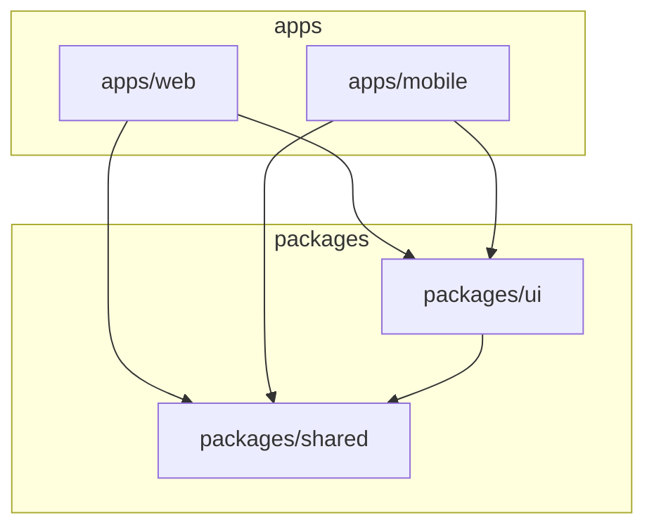

# Plan 07 - Monorepo Setup (pnpm + Turborepo)

이 문서는 `pnpm workspace`와 `Turborepo`를 기반으로 한 프로젝트의 모노레포 구조 및 설정 계획을 기술합니다.

## 1. 개요

- **Package Manager**: `pnpm` (효율적인 의존성 관리 및 디스크 공간 절약)
- **Build System**: `Turborepo` (캐싱 및 병렬 실행을 통한 빌드 속도 최적화)
- **Structure**:
  - `apps/`: 실행 가능한 애플리케이션
  - `packages/`: 공유 라이브러리 및 설정

## 2. 디렉토리 구조

```
cleaning-reservation-sys/
├── apps/
│   ├── mobile/          # Expo React Native (iOS/Android)
│   └── web/             # TanStack Start (Web/SSR/API)
├── packages/
│   ├── shared/          # 공통 로직 (Types, Zod schemas, Constants, Utils)
│   └── ui/              # 공통 UI (Tailwind Config, Components)
├── package.json         # Root configuration
├── pnpm-workspace.yaml  # Workspace definition
├── turbo.json           # Turborepo pipeline config
└── README.md
```

## 3. Root 설정

### `pnpm-workspace.yaml`

```yaml
packages:
  - "apps/*"
  - "packages/*"
```

### `package.json` (Root)

```json
{
  "name": "cleaning-reservation-sys-root",
  "private": true,
  "scripts": {
    "build": "turbo run build",
    "dev": "turbo run dev",
    "lint": "turbo run lint",
    "clean": "turbo run clean && rm -rf node_modules"
  },
  "devDependencies": {
    "turbo": "^2.0.0",
    "typescript": "^5.0.0",
    "prettier": "^3.0.0",
    "eslint": "^8.0.0"
  },
  "packageManager": "pnpm@9.x.x"
}
```

### `turbo.json`

```json
{
  "$schema": "https://turbo.build/schema.json",
  "pipeline": {
    "build": {
      "dependsOn": ["^build"],
      "outputs": ["dist/**", ".next/**", "public/dist/**"]
    },
    "dev": {
      "cache": false,
      "persistent": true
    },
    "lint": {}
  }
}
```

## 4. 패키지 상세 설계

### 4.1. `packages/shared`

앱과 웹에서 공통으로 사용하는 비즈니스 로직 및 타입 정의입니다.

- **역할**:
  - 데이터 모델 (TypeScript Interfaces)
  - API 요청/응답 스키마 (Zod)
  - 날짜/시간 포맷팅 등 순수 함수 유틸리티
- **의존성**: 외부 라이브러리 최소화 (e.g., `zod`, `date-fns`)
- **package.json**:
  ```json
  {
    "name": "@cleaning/shared",
    "version": "0.0.0",
    "main": "./src/index.ts",
    "types": "./src/index.ts",
    "scripts": {
      "build": "tsc",
      "dev": "tsc --watch"
    }
  }
  ```

### 4.2. `packages/ui`

디자인 시스템 및 공통 컴포넌트 라이브러리입니다.

- **역할**:
  - Tailwind CSS 설정 공유 (`tailwind.config.js`)
  - React Native와 Web(React DOM) 호환성을 고려한 컴포넌트 설계 (가능한 경우)
    - *참고: React Native Web을 사용하거나, 플랫폼별로 분기 처리*
  - 기본 UI 컴포넌트 (Button, Input, Card 등)
- **의존성**: `react`, `react-native` (peer), `tailwindcss`, `nativewind` (선택적)
- **package.json**:
  ```json
  {
    "name": "@cleaning/ui",
    "version": "0.0.0",
    "main": "./src/index.tsx",
    "types": "./src/index.tsx",
    "peerDependencies": {
      "react": "*",
      "react-native": "*"
    },
    "devDependencies": {
      "@cleaning/shared": "workspace:*"
    }
  }
  ```

### 4.3. `apps/web`

TanStack Start 기반의 웹 애플리케이션 및 백엔드 API 서버입니다.

- **역할**:
  - 사용자 대시보드 (Admin/User)
  - SSR 및 SEO
  - API Routes (Backend)
- **의존성**:
  - `@cleaning/shared`: API 스키마 및 타입 사용
  - `@cleaning/ui`: 웹용 UI 컴포넌트 사용
- **스크립트**:
  - `dev`: `vinxi dev`
  - `build`: `vinxi build`

### 4.4. `apps/mobile`

Expo (React Native) 기반의 모바일 앱입니다.

- **역할**:
  - 사용자 앱 (iOS/Android)
  - 네이티브 기능 (카메라, 위치, 푸시 알림)
- **의존성**:
  - `@cleaning/shared`: API 클라이언트 타입
  - `@cleaning/ui`: 모바일용 UI 컴포넌트 사용
- **스크립트**:
  - `dev`: `expo start`
  - `android`: `expo start --android`
  - `ios`: `expo start --ios`

## 5. 의존성 그래프 (Dependency Graph)



## 6. 초기 설정 체크리스트

1. [ ] `pnpm init` 및 워크스페이스 설정 파일 생성
2. [ ] `packages/shared` 생성 및 `zod` 설치, 기본 타입 정의
3. [ ] `packages/ui` 생성 및 Tailwind 설정 내보내기 구성
4. [ ] `apps/web` (TanStack Start) 초기화 및 로컬 패키지 연결
5. [ ] `apps/mobile` (Expo) 초기화 및 메트로 번들러 설정(Monorepo 호환)
6. [ ] `turbo.json` 파이프라인 테스트 (`pnpm build`)
